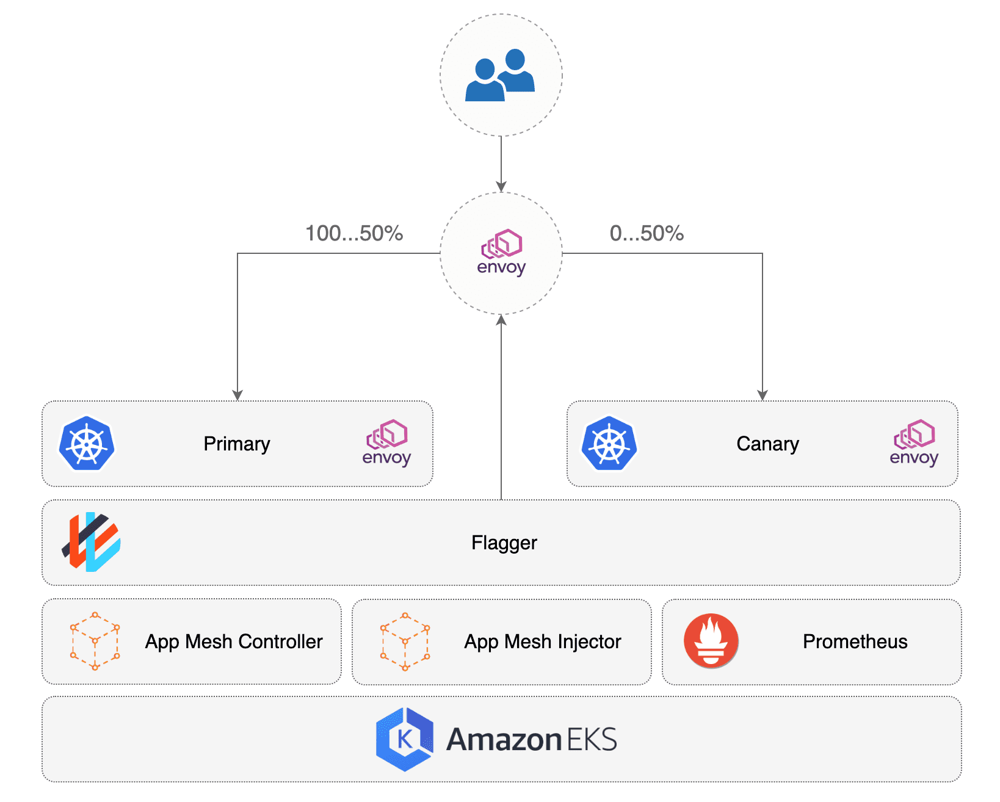
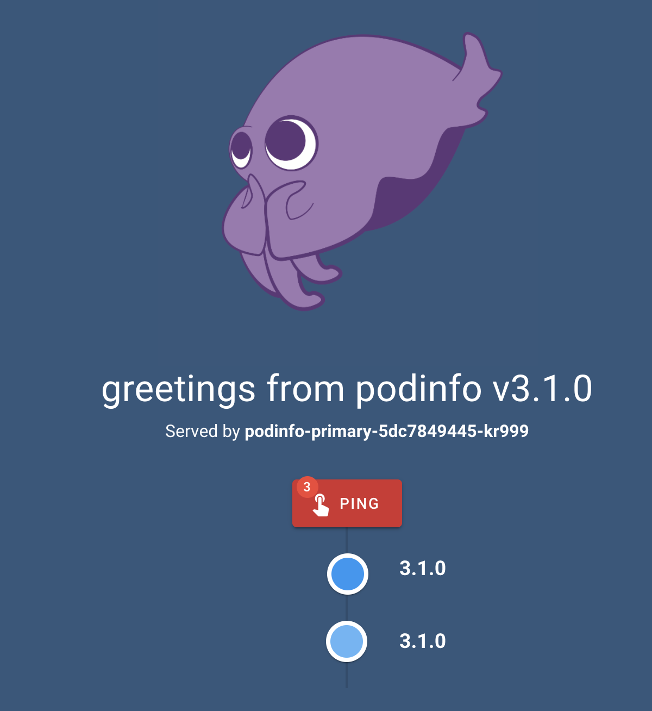

# appmesh

## Setup repo
This repo was setup using eksctl,
[git@github.com:seizadi/eksctl.git repo](https://github.com/seizadi/eksctl),
was used to create , see
[it using Weaveworks eksctl](https://eks.handson.flagger.dev/profile/#create-a-github-repository).
This is created using:
```bash
make repo
make mesh
```
The project is a demo of Weaveworks partnership with AWS to deploy a Gitops native k8s deployment
pipeline. The manifests in ./base/appmesh-system and ./base/kube-system and ./flux would be
removed and will be part of cluster orchestration as the services deployed would be used by
all applications. The cluster services that are orchestrated by the manifest are:
   * Declare CRDs used by AWS AppMesh and Weaveworks Flux and Flagger
   * Deploy Flux system including Flux Controller, Helm Operator and Memcache
   * Deploy AppMesh system including AppMesh Controller, Grafana, Prometheus and Flagger
   * Deploy Prometheus server used as Metrics Server in the cluster

We use [kustomize](https://github.com/kubernetes-sigs/kustomize) to setup the project for the pipeline
deployment:
```bash
for dir in ./flux ./base; do
  ( pushd "$dir" && kustomize create --autodetect --recursive )
done
```
To complete the kustomize setup with setup the top level yaml:
```bash
cat << EOF | tee kustomization.yaml
apiVersion: kustomize.config.k8s.io/v1beta1
kind: Kustomization
bases:
  - base
  - flux
EOF
```
The cluster we crated in
[git@github.com:seizadi/eksctl.git repo](https://github.com/seizadi/eksctl),
has a Flux controller watching this repo and we need a .flux.yaml for it to know how to build
the repo: 
```bash
cat << EOF | tee .flux.yaml
version: 1
commandUpdated:
  generators:
    - command: kustomize build .
EOF
```
Verify kustomize is working before commit
```bash
kubectl apply --dry-run -k .
```
You can see the deployed manifests:
```bash
kustomize build . | more
```
When we commit this will get deployed to the cluster
```bash
$ git add .
$ git status
On branch master
Your branch is up to date with 'origin/master'.

Changes to be committed:
  (use "git reset HEAD <file>..." to unstage)

        new file:   .flux.yaml
        modified:   README.md
        new file:   base/kustomization.yaml
        new file:   flux/kustomization.yaml
        new file:   kustomization.yaml
```
Now we commit the changes and use fluxctl sync to force change
rather than wait for the poll cycle to apply:
```bash
$ git push
$ fluxctl sync --k8s-fwd-ns flux
```

## Setup canary
The 'make repo' step above lays down a sample application
[podinfo](https://github.com/stefanprodan/podinfo), which is under the base
directory, you could have a more complex application but this is a good way to
test the Flux canary provider by 
[Flagger](https://www.weave.works/oss/flagger/)
and integration with AWS AppMesh.


Here is the layout of demo app under base/demo
directory:
```bash
$ tree base/demo
base/demo
├── ingress # Envoy Proxy
│   └── appmesh-gateway.yaml
├── namespace.yaml
├── podinfo # Demo Application
│   ├── canary.yaml
│   ├── deployment.yaml
│   └── hpa.yaml
└── tester # Flagger Test Runner
    ├── deployment.yaml
    ├── service.yaml
    └── virtual-node.yaml
```
We can orchestrate the canary release using
[CRD Canary](base/demo/podinfo/canary.yaml).
[See Flagger Cannary detail description](https://eks.handson.flagger.dev/canary/#canary-custom-resource).
Flagger controls 
[Deployment](base/demo/podinfo/deployment.yaml) and
[Horizontal Pod Authoscaler (HPA)](base/demo/podinfo/hpa.yaml).
    
The initial demo application is installed with annotation so that it is
ignored by Flux this allows us to stage the overall system and also follow
lab:
```yaml
  annotations:
    fluxcd.io/ignore: "true"
```
We set this annotation in [namespace.yaml](base/demo/namespace.yaml) to
false and commit the change so that Flux will deploy it:
```bash
git add .
git commit -m "run demo"
git push
fluxctl sync --k8s-fwd-ns flux
```
Now you see the demo namespace and associated deployment:
```bash
$ kubectl -n demo get deployments
NAME                 READY   UP-TO-DATE   AVAILABLE   AGE
appmesh-gateway      1/1     1            1           93s
flagger-loadtester   1/1     1            1           94s
podinfo              0/0     0            0           94s
podinfo-primary      2/2     2            2           85s
$ kubectl -n demo get pods
NAME                                READY   STATUS    RESTARTS   AGE
appmesh-gateway-6db54dd9f-w7lvk     3/3     Running   0          67s
flagger-loadtester-8cc68bcc-4xp6v   2/2     Running   0          68s
podinfo-primary-5dc7849445-kr999    2/2     Running   0          59s
podinfo-primary-5dc7849445-qgsr9    1/2     Running   0          4s
```
Make sure canary is initalized:
```bash
$ kubectl -n demo get canary
NAME      STATUS        WEIGHT   LASTTRANSITIONTIME
podinfo   Initialized   0        2020-05-25T04:49:07Z
```
Now we can find the URL for the application:
```bash
export URL="http://$(kubectl -n demo get svc/appmesh-gateway -ojson | jq -r ".status.loadBalancer.ingress[].hostname")"
echo $URL
```
Make sure DNS is servered for it:
```bash
watch host $URL
```
Make sure webserver is operational:
```bash
watch curl -s $URL

```
Open browser to show webpage:
```bash
open $URL
```
Assuming everything is working you should the podinfo page:


## Canary Promotion

This section we will promote the podinfo to a new release and watch canary
promotion, for this follow
[Eks Handson Lab for detail](https://eks.handson.flagger.dev/canary/#automated-canary-promotion).
```bash
mkdir -p overlays && \
cat << EOF | tee overlays/podinfo.yaml
apiVersion: apps/v1
kind: Deployment
metadata:
  name: podinfo
  namespace: demo
spec:
  template:
    spec:
      containers:
        - name: podinfod
          image: stefanprodan/podinfo:3.1.1
          env:
            - name: PODINFO_UI_LOGO
              value: https://eks.handson.flagger.dev/cuddle_bunny.gif
EOF
```
This overlay, changes the podinfo image from 3.1.0 and cuddle_clap logo
```yaml
        image: stefanprodan/podinfo:3.1.0
        env:
          - name: PODINFO_UI_LOGO
            value: https://eks.handson.flagger.dev/cuddle_clap.gif
```
to 3.1.1 and the logo to a cuddle_bunny:
```bash
mkdir -p overlays && \
cat << EOF | tee overlays/podinfo.yaml
apiVersion: apps/v1
kind: Deployment
metadata:
  name: podinfo
  namespace: demo
spec:
  template:
    spec:
      containers:
        - name: podinfod
          image: stefanprodan/podinfo:3.1.1
          env:
            - name: PODINFO_UI_LOGO
              value: https://eks.handson.flagger.dev/cuddle_bunny.gif
EOF
```
We update kustomize to apply this change to the manifest:
```bash
cat << EOF | tee kustomization.yaml
apiVersion: kustomize.config.k8s.io/v1beta1
kind: Kustomization
bases:
  - base
  - flux
patchesStrategicMerge:
  - overlays/podinfo.yaml
EOF
```
This will be picked up by
Flux when we comit the change:
```bash
git add .
git commit -m "podinfo bumped to release 3.1.1 with new logo"
git push
fluxctl sync --k8s-fwd-ns flux
```
When Flagger detects that the deployment revision changed it will start a new rollout. 
You can monitor the traffic shifting with:
```bash
kubectl -n demo get --watch canaries
```
Watch Flagger logs:
```bash
kubectl -n appmesh-system logs deployment/flagger -f | jq .msg
```
## Canary Rollback

This section we will promote the podinfo to a new release and watch canary
rollback. During the canary analysis you can generate HTTP 500 errors and high latency
to test if Flagger pauses and rolls back the faulted version. For this follow
[Eks Handson Lab for detail](https://eks.handson.flagger.dev/canary/#automated-rollback).

In this test we will promote to a release 3.1.2 that has been instrumented to fail and
cause Flagger to rollback to the previous 3.1.1 release:
```bash
$ git diff overlays/podinfo.yaml 
diff --git a/overlays/podinfo.yaml b/overlays/podinfo.yaml
index a9410d1..a6dfbb0 100644
--- a/overlays/podinfo.yaml
+++ b/overlays/podinfo.yaml
@@ -8,7 +8,7 @@ spec:
     spec:
       containers:
         - name: podinfod
-          image: stefanprodan/podinfo:3.1.1
+          image: stefanprodan/podinfo:3.1.2
           env:
             - name: PODINFO_UI_LOGO
               value: https://eks.handson.flagger.dev/cuddle_bunny.gif
```
Commit changes:
```bash
git add .
git commit -m "update podinfo to release 3.1.2"
git push
fluxctl sync --k8s-fwd-ns flux
```
Exec into the tester pod and generate HTTP 500 errors:
```bash
kubectl -n demo exec -it $(kubectl -n demo get pods -o name | grep -m1 flagger-loadtester | cut -d'/' -f 2) bash
```
```bash
bash-5.0$ hey -z 1m -c 5 -q 5 http://podinfo-canary.demo:9898/status/500
bash-5.0$ hey -z 1m -c 5 -q 5 http://podinfo-canary.demo:9898/delay/1
```
When the number of failed checks reaches the canary analysis threshold,
the traffic is routed back to the primary and the canary is scaled to zero.

Watch Flagger logs with:
```bash
kubectl -n appmesh-system logs deployment/flagger -f | jq .msg
```

## A/B Testing

Besides weighted routing, Flagger can be configured to route traffic to the canary based on
HTTP match conditions. In an A/B testing scenario, you'll be using HTTP headers or
cookies to target a certain segment of your users. This is particularly useful for 
frontend applications that require session affinity.
For this follow
[Eks Handson Lab for detail](https://eks.handson.flagger.dev/canary/#a-b-testing).

Create a Kustomize patch for the canary configuration by removing 
the max/step weight and adding a HTTP header match condition and iterations:
```bash
cat <<EOF | tee overlays/canary.yaml
apiVersion: flagger.app/v1beta2
kind: Canary
metadata:
  name: podinfo
  namespace: demo
spec:
  analysis:
    interval: 30s
    threshold: 10
    iterations: 10
    match:
      - headers:
          user-agent:
            regex: ".*Chrome.*"
EOF
```

The above configuration will run a canary analysis for 
five minutes (interval * iterations) targeting users with Chromium-based browsers, other
browsers FireFox or Safari see the older release. Add the canary patch to the kustomization:
```bash
cat <<EOF | tee kustomization.yaml
apiVersion: kustomize.config.k8s.io/v1beta1
kind: Kustomization
bases:
  - base
  - flux
patchesStrategicMerge:
  - overlays/podinfo.yaml
  - overlays/canary.yaml
EOF
```
Change the release to 3.1.3
```bash
$ git diff overlays/podinfo.yaml 
diff --git a/overlays/podinfo.yaml b/overlays/podinfo.yaml
index a6dfbb0..0ab5fd4 100644
--- a/overlays/podinfo.yaml
+++ b/overlays/podinfo.yaml
@@ -8,7 +8,7 @@ spec:
     spec:
       containers:
         - name: podinfod
-          image: stefanprodan/podinfo:3.1.2
+          image: stefanprodan/podinfo:3.1.3
           env:
             - name: PODINFO_UI_LOGO
               value: https://eks.handson.flagger.dev/cuddle_bunny.gif
```
Commit and push changes so that we promote new release:
```bash
git add .
git commit -m "update podinfo to release 3.1.3 again with fix to kustomize"
git push
fluxctl sync --k8s-fwd-ns flux
```
I could not get A/B routing to work, see debug log below.

## Creating and Running Canary Tests
The demo application has a test runner pod deployed and we can use webhooks in Flagger to run
automated tests for each release. For this follow
[Eks Handson Lab for detail](https://eks.handson.flagger.dev/test/#create-tests).
```yaml
cat << EOF | tee overlays/canary.yaml
apiVersion: flagger.app/v1beta1
kind: Canary
metadata:
  name: podinfo
  namespace: demo
spec:
  analysis:
    webhooks:
      - name: acceptance-test-token
        type: pre-rollout
        url: http://flagger-loadtester.demo/
        timeout: 30s
        metadata:
          type: bash
          cmd: "curl -sd 'test' http://podinfo-canary.demo:9898/token | grep token"
      - name: acceptance-test-tracing
        type: pre-rollout
        url: http://flagger-loadtester.demo/
        timeout: 30s
        metadata:
          type: bash
          cmd: "curl -s http://podinfo-canary.demo:9898/headers | grep X-Request-Id"
      - name: load-test
        url: http://flagger-loadtester.demo/
        timeout: 5s
        metadata:
          cmd: "hey -z 1m -q 10 -c 2 http://podinfo-canary.demo:9898/"
EOF
```
We set the release to 3.1.4 and check the logs for the test being run from webhook:
```bash
"Starting canary analysis for podinfo.demo"
"Pre-rollout check acceptance-test-token passed"
"Pre-rollout check acceptance-test-tracing passed"
"Advance podinfo.demo canary weight 5"
```

## AWS XRay integration with AppMesh
One of key points of ServiceMesh architecture is to enable logging and tracing without any
changes to the application. I thought that tracing would work with AppMesh but I was dissapointed that this does not
work out of the box, 
[see following AWS Note](https://aws.amazon.com/blogs/compute/integrating-aws-x-ray-with-aws-app-mesh/)
on how to enable it.

## AWS CloudWatch integration with AppMesh
Similarly AppMesh logs are not in CloudWatch either, they require running FluentD in
the cluster and pushing the logs out. This is a common pattern for log collection, there is 
[partial note here around access logs](https://docs.aws.amazon.com/AmazonCloudWatch/latest/monitoring/ContainerInsights-Prometheus-Sample-Workloads-appmesh-envoy.html)                              

## Cleanup
After you have finished the hands-on lab and was to terminate the cluster run
```bash
make clean
```

## Debug
As murphy would have it for my last test I started getting these errors:
```bash
$ fluxctl sync --k8s-fwd-ns flux
Synchronizing with ssh://git@github.com/seizadi/appmesh
Revision of master to apply is e9f0a4e
Waiting for e9f0a4e to be applied ...
Error: timeout
```
Look at flex controller logs:
```bash
kubectl -n flux logs deployment/flux
....
ts=2020-05-25T06:15:28.88533029Z caller=loop.go:107 component=sync-loop err="loading resources from repo: error executing generator command \"kustomize build .\" from file \".flux.yaml\": exit status 1\nerror output:\nError: no matches for OriginalId flagger.app_v1beta2_Canary|demo|podinfo; no matches for CurrentId flagger.app_v1beta2_Canary|demo|podinfo; failed to find unique target for patch flagger.app_v1beta2_Canary|podinfo\n\ngenerated output:\nError: no matches for OriginalId flagger.app_v1beta2_Canary|demo|podinfo; no matches for CurrentId flagger.app_v1beta2_Canary|demo|podinfo; failed to find unique target for patch flagger.app_v1beta2_Canary|podinfo\n"
ts=2020-05-25T06:17:53.068604425Z caller=images.go:17 component=sync-loop msg="polling for new images for automated workloads"
ts=2020-05-25T06:17:53.167381283Z caller=images.go:23 component=sync-loop error="getting unlocked automated resources: error executing generator command \"kustomize build .\" from file \".flux.yaml\": exit status 1\nerror output:\nError: no matches for OriginalId flagger.app_v1beta2_Canary|demo|podinfo; no matches for CurrentId flagger.app_v1beta2_Canary|demo|podinfo; failed to find unique target for patch flagger.app_v1beta2_Canary|podinfo\n\ngenerated output:\nError: no matches for OriginalId flagger.app_v1beta2_Canary|demo|podinfo; no matches for CurrentId flagger.app_v1beta2_Canary|demo|podinfo; failed to find unique target for patch flagger.app_v1beta2_Canary|podinfo\n"
```
Looks like we broke Kustomize with our checkin, we can verify this by running it. This would be
a good test to have on your PRs before allowing a promotion.
localy:
```bash
$ kubectl apply --dry-run -k .
error: failed to find an object with flagger.app_v1beta2_Canary|podinfo to apply the patch
```
I set the canary overlay to 'apiVersion: flagger.app/v1beta1' which fixed the above error but
the routing did not work why it was probably changed. When I try to set it v1beta2 I get this error
```bash
$ kubectl apply --dry-run -k .
...
error: unable to recognize ".": no matches for kind "Canary" in version "flagger.app/v1beta2"
```
Since the 
[CRD applied to the cluster](base/appmesh-system/flagger-crds.yaml)
for the demo only supports v1beta1:
```bash
apiVersion: apiextensions.k8s.io/v1beta1
kind: CustomResourceDefinition
metadata:
  name: canaries.flagger.app
  annotations:
    helm.sh/resource-policy: keep
spec:
  group: flagger.app
  version: v1beta1
  versions:
    - name: v1beta1
      served: true
      storage: true
    - name: v1alpha3
      served: true
      storage: false
    - name: v1alpha2
      served: false
      storage: false
    - name: v1alpha1
      served: false
      storage: false
```
